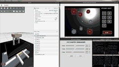

# Vision-Guided Robotic Microscope

A ROS 2 + Gazebo simulation of a vision-guided Cartesian positioning stage for automated microscope specimen positioning.

## Overview

The system models a laboratory-style microscope in which the microscope optics and camera remain fixed while a lightweight specimen stage moves in **X, Y and Z**.

The control loop is:

**Camera → OpenCV vision → specimen centroid → image error → PID controller → XYZ stage velocity → updated camera image**

The project is intended as a simulation and control-system demonstration of automated specimen positioning.

## System Architecture

```
              FIXED MICROSCOPE
             ┌─────────────────┐
             │ Camera / Optics │
             └────────┬────────┘
                      │
                      ▼
                 SPECIMEN
                      │
                    Z STAGE
                      │
                    Y STAGE
                      │
                    X STAGE
                      │
                 FIXED BASE
```

## Main Components

### 1. 3-Axis Cartesian Stage

The URDF models three prismatic axes controlled through `ros2_control`.

| Axis | Travel |
|---|---:|
| X | -0.10 m to +0.10 m |
| Y | -0.08 m to +0.08 m |
| Z | 0.00 m to +0.05 m |

The stage carries a simulated glass slide with colored specimen objects.

### 2. Simulated Microscope Camera

Gazebo provides the camera sensor mounted to the fixed microscope structure. The camera image is bridged into ROS 2 using `ros_gz_image`.

### 3. OpenCV Vision Pipeline

The vision node:

- receives the Gazebo camera stream
- converts ROS images to OpenCV frames using CvBridge
- performs HSV-based color segmentation
- extracts connected components
- estimates specimen centroids
- calculates the image-space error from the optical center
- generates X/Y stage velocity commands

### 4. PID-Based Closed-Loop Control

The controller converts image-space error into stage velocity commands.

The current controller uses:

- proportional gain for X/Y
- derivative gain for X/Y
- zero integral gain
- a 5-pixel deadband
- a maximum stage command of 0.03 m/s

The controller is intended to demonstrate closed-loop visual positioning rather than claim experimentally measured microscope positioning accuracy.

### 5. Manual XYZ Debug GUI

The repository also includes an XYZ slider interface for manually testing the stage controller.

## Repository Structure

```
.
├── config/
│   └── controllers.yaml
├── launch/
│   └── xyz_test.launch.py
├── scripts/
│   ├── vision_detector.py
│   └── xyz_slider_gui.py
├── urdf/
│   └── xyz_cam/
│       └── xyz_cam.urdf
├── worlds/
│   └── xyz_test.world
├── CMakeLists.txt
└── package.xml
```

## Software Stack

- Ubuntu
- ROS 2 Humble
- Gazebo Sim
- URDF
- ros2_control
- OpenCV
- Python
- CvBridge
- ROS-Gazebo image bridge

## Running the Simulation

After placing the package inside a ROS 2 workspace:

```bash
cd ~/morphle_ws
colcon build --symlink-install
source install/setup.bash
ros2 launch morphle_stage xyz_test.launch.py
```

The launch file is configured to start the Gazebo world, spawn the microscope model, start the controllers, bridge the camera image, and launch the vision and XYZ GUI nodes.

## Control Topics

The main stage command topic is:

```
/stage_velocity_controller/commands
```

The simulated microscope camera image is bridged from the Gazebo camera sensor.

## Project Image

The image below shows the simulated microscope/stage project included with the repository.



## Notes

This repository contains the simulation and control implementation used for development of the vision-guided robotic microscope concept. Mechanical dimensions, controller parameters and camera settings are simulation parameters and should not be interpreted as measured hardware performance.

## Author

**Krishna Patel**  
Electronics & Communication Engineering  
Nirma University
